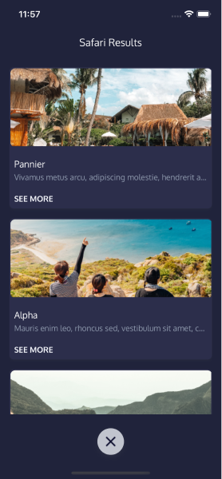
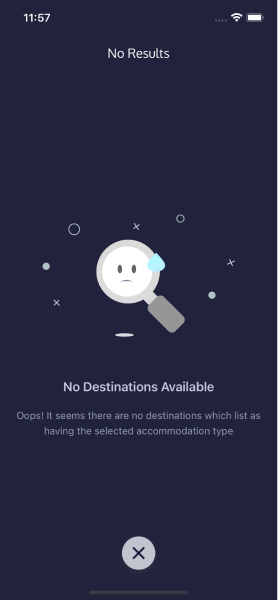
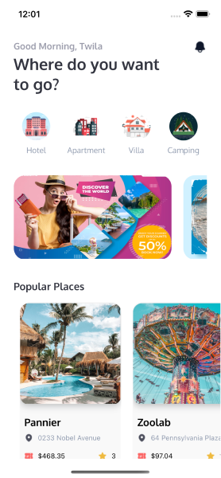
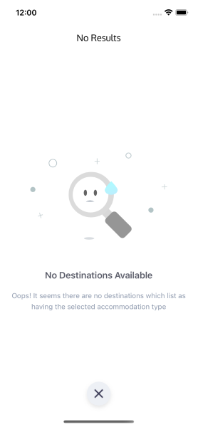
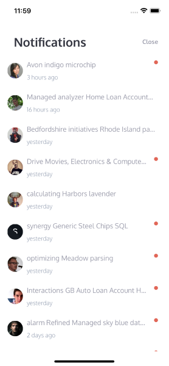

# Travel and Destinations App

This is a sample application developed using .Net MAUI.
Vector images within the app are sourced from [FreePik.Com](https://www.freepik.com). I am grateful to them for providing such a free service, especially the creators of the graphics.

Animation used in Empty Destination Filter page was obtained from [LottieFiles](https://lottiefiles.com)

## Dark Mode Screenshots

## Light Mode Screenshots

